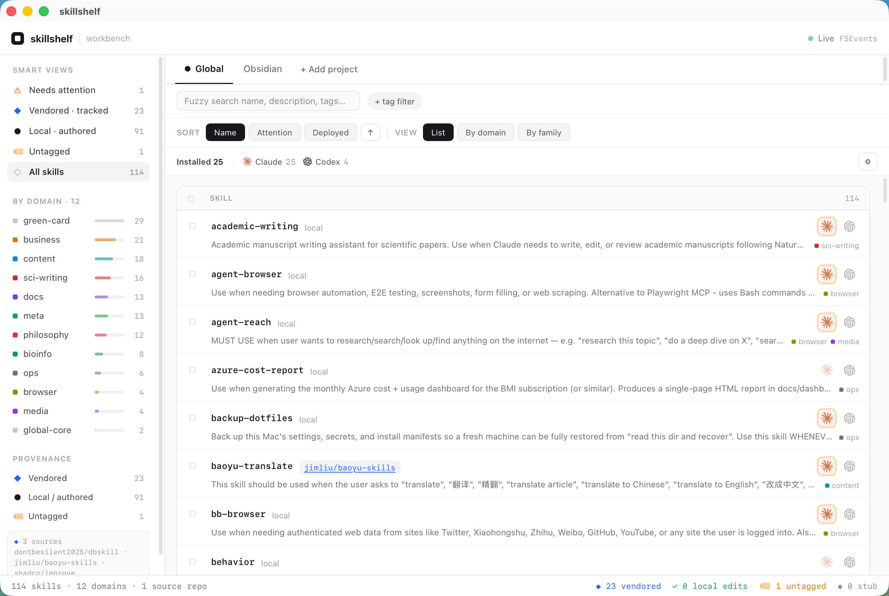
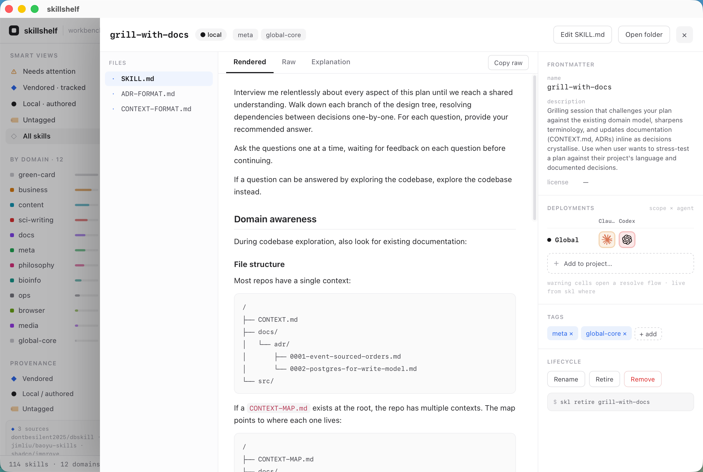

# skillshelf

**A package manager for your agent skills — one canonical library, loaded on demand, never all at once.**

[](./LICENSE)
[](https://bun.sh)
[](https://github.com/Wang-Cankun/skillshelf/actions)
[](https://www.npmjs.com/package/skillshelf)

Your skills are scattered across **every agent you use** — some in `~/.claude/skills`, some in
`~/.codex/skills` or `~/.cursor/skills`, some buried in Obsidian or notes vaults, more copied into
a dozen per-project `.claude` / `.codex` directories. Each tool scatters its own copies and
symlinks; you forget which ones exist, rewrite ones you already have, and copies drift out of sync.
The naive fix — dump everything into one agent's dir — makes every session pay the token cost of
loading hundreds of skill descriptions at once.

skillshelf is **agent-agnostic** (Claude Code, Codex, Cursor, and compatible agents): the library
is a neutral source, and `skl where` maps where every skill is actually deployed across all of
them — surfacing untracked copies, drift, and dead links. It's the curation layer *over* your
agent dirs, complementary to installers like [`vercel-labs/skills`](https://github.com/vercel-labs/skills).

skillshelf is the middle path: a single git-backed **library** that is a *passive shelf*
(nothing auto-loads), plus a CLI to **search, tag, bundle, and load** exactly the skills a
project needs, exactly when it needs them. Find anything in one place; pay only for what you
actually use.

## Desktop app

A cross-platform desktop UI (React + Tauri) sits on top of the same engine — a **Library-first**
workbench for managing where every skill is deployed across your agents. It reads the **real**
`skl` library (no separate data store) and every toggle writes the same symlinks the CLI does.



- **Library-first, skill-centric list** — scan all skills, flip them on/off per agent inline; a
  top **scope switcher** (Global · each project · + Add project) and a per-scope count bar.
- **Project scopes** — manage a project's loadout without leaving the app; globally-deployed
  skills show an *"active via Global"* inherited state so you always know what's effectively live.
- **Two-tier toggles** — a clean on/off for the happy path, but drift / copy / dead / aliased
  surface a resolve flow instead of silently doing the wrong thing (state is derived from the
  filesystem, never stored — so the UI can't lie about what's deployed).



The detail drawer shows a skill's body, tags, provenance, and an `agent × scope` deployment
matrix (Global + the projects where it's pinned), plus lifecycle actions.

> Browser/dev mode (`cd app && bun run dev`) renders synthetic fixtures with no backend; the
> packaged desktop app talks to your real `skl` engine. See [`docs/adr/0010-*`](docs/adr/) for the
> design.

## Install

skillshelf runs on [Bun](https://bun.sh) (>= 1.0). No other runtime dependencies.

> **Bun is required, not optional.** The `skl` bin is a TypeScript entrypoint with a
> `#!/usr/bin/env bun` shebang — there is no compiled Node build. `npm i -g skillshelf`
> will *not* give you a working `skl` (a `preinstall` guard aborts with a pointer to Bun);
> use `bunx` or `bun add -g` instead.

```bash
# Run it without installing
bunx skillshelf <command>

# Or install the `skl` binary globally
bun add -g skillshelf
skl <command>
```

## Quickstart

```bash
# 1. Set up the config + library and link the thin global core
skl init

# 2. Scaffold a new skill into the library (or `skl add` a third-party one)
skl new rnaseq-qc --domain bioinfo --desc "QC gate for RNA-seq count matrices"

# 3. Find skills across the whole library
skl ls
skl search rnaseq

# 4. Read a skill's instructions on demand — no token cost until you ask
skl show rnaseq-qc

# 5. Activate a domain bundle in the project you're working in
cd ~/projects/my-analysis
skl use bioinfo      # symlinks every skill tagged `bioinfo` into ./.claude/skills
skl status           # what's currently linked here
skl drop bioinfo     # unlink when you're done
```

Add `--json` to any command for machine-readable output (skillshelf is built to be driven
by an agent as well as a human).

## Migrating scattered skills

Already have skills strewn across `~/.claude/skills`, an Obsidian vault, and a dozen project
`.claude` dirs? Consolidate them with three deterministic primitives — `scan` discovers,
`import` adopts, `infer` tags. The judgment in between (which copies to keep, which drift wins)
is yours (or your agent's); the tool never guesses.

```bash
# 1. Register the places your skills live, then take a read-only inventory.
#    scan moves nothing — it just reports candidates, duplicates, and drift.
skl scan --add-root ~/.claude/skills
skl scan --add-root ~/notes/.agents/skills
skl scan                       # report every candidate + duplicate/drift group

# 2. Adopt the ones you want, one at a time. Each import moves the skill into the
#    library and leaves a symlink behind so old paths keep resolving.
skl import rnaseq-qc --from ~/.claude/skills/rnaseq-qc
skl import headline-picker --from ~/notes/.agents/skills/headline-picker

#    For a skill living inside a project repo, copy instead of move (no symlink left behind):
skl import deploy-check --from ~/projects/web/.claude/skills/deploy-check --copy

#    When two copies drifted and you've picked the winner, overwrite the loser:
skl import rnaseq-qc --from ~/projects/lab/.claude/skills/rnaseq-qc --force

#    For a skill you actively develop in its own git repo, shelve a LINK instead of a copy —
#    the repo stays canonical and edits show up live, no drift, no re-sync (ADR-0004):
skl link --from ~/Documents/GitHub/claim-log/skill/claim-log

# 3. Tag the now-populated library in one pass. Domain is tags, not folders, so this
#    runs AFTER import with no reorg — no skill ever has to move because a tag changed.
skl infer --emit               # hand the payload to your agent, then `skl infer --apply`
```

Domain lives entirely in tags ([ADR-0001](./docs/adr/0001-domain-is-tags-not-folders.md)): the
library layout is flat (`library/<name>/`) and `import` never decides a domain, so there is no
chicken-and-egg between adopting a skill and tagging it.

## How it works

skillshelf separates *owning* a skill from *loading* it.

- **Canonical library** — a dedicated git repo, one copy per skill in a flat, non-semantic
  layout (`library/<name>/`). This is a passive shelf: nothing here auto-loads, which is
  exactly what kills the all-at-once token cost.
- **Domain bundles** — domain is *tags, not folders* ([ADR-0001](./docs/adr/0001-domain-is-tags-not-folders.md)).
  A skill tagged `domains: [coding, bioinfo]` shows up in both bundles from a single copy on
  disk; `skl use bioinfo` resolves every skill carrying that tag. `primaryDomain` is just
  `domains[0]`, never inferred from a folder.
- **Thin global core** — a handful of universal skills (commit, search, memory) are
  symlinked permanently into `~/.claude/skills` so they always auto-trigger. Small, bounded
  token cost — "some loaded is fine; all-at-once is the problem."
- **On-demand `show`** — prints only the SKILL.md instruction body and lists the paths of
  any bundled reference files (without reading them). Progressive disclosure: cheap by
  default, deep when you ask. Works mid-task with no reload.
- **Owned vs linked entries** ([ADR-0004](./docs/adr/0004-owned-vs-linked-entries.md)) — the
  library is a *bookshelf*: an entry either **owns** its bytes (a real copy; the library is
  canonical — for downloads and stabilized skills) or is **linked** (a symlink to an external dev
  repo that stays canonical — for skills you actively develop in their own git, e.g. `claim-log`).
  `skl link --from <dev-repo>` registers a linked entry; `skl where` shows it as a clean
  `✓ source`; `skl update` / `outdated` skip linked entries so they never pull upstream into your
  dev repo. The mode is derived from the filesystem (a symlink resolving outside the library),
  never stored, so it can't go stale.
- **Updates never clobber your tags** — domain tags live in the central `taxonomy.json`
  ([ADR-0002](./docs/adr/0002-central-taxonomy-not-sidecars.md)), separate from the skill body, so
  `skl update` can swap an owned skill's upstream `SKILL.md` cleanly while your taxonomy survives.

```
                       skl search / ls / show          skl use <bundle>
                                │                              │
   ┌──────────────────────┐    │   ┌──────────────────────┐   │   ┌─────────────────────┐
   │   canonical library  │────┴──▶│   bundles = tag query │───┴──▶│  project .claude/   │
   │  (passive git shelf) │        │  bioinfo · coding · … │       │  skills/ (symlinks) │
   └──────────┬───────────┘        └──────────────────────┘       └─────────────────────┘
              │
              └──── thin global core ──▶ ~/.claude/skills  (always-on, bounded)
```

See [docs/ARCHITECTURE.md](./docs/ARCHITECTURE.md) for the full design.

## Command reference

| Command | Summary | Key flags |
|---|---|---|
| `skl init` | Set up `~/.skillshelf` config + library and link the global-core skills | `--force` |
| `skl scan [roots…]` | Read-only discovery of skill candidates across roots (counts, duplicates, drift) | `--add-root <path>`, `--remove-root <path>` |
| `skl roots` | List the persisted scan roots (read-only; no crawl) | — |
| `skl import <name> --from <path>` | Adopt your own skill into the library as an OWNED copy (move + symlink-back, or `--copy`) | `--copy`, `--as <slug>`, `--force` |
| `skl link [<name>] --from <dev-repo>` | Shelve a dev-repo skill as a LINKED entry (library symlinks to it; the repo stays canonical). `--at <path>` instead collapses a stray copy into the library | `--from`, `--at`, `--force` |
| `skl new <name>` | Scaffold a new skill dir + SKILL.md into the library | `--domain <d>`, `--desc "..."`, `--force` |
| `skl ls [bundle]` | One-line listing of the library, or one bundle (`--json` carries `mode`/`linkTarget`) | `--all` |
| `skl search <kw...>` | Fuzzy match over name + description + domains across the library | — |
| `skl show <name>` | Print a skill's SKILL.md body; list reference-file paths (not contents) | — |
| `skl tag <name> <domain>…` | Add domain tag(s) to a skill in the central taxonomy (deterministic, no LLM) | — |
| `skl untag <name> <domain>` | Remove a domain tag from a skill | — |
| `skl retag <old> <new>` | Rename a domain across the whole library taxonomy (deterministic) | — |
| `skl rename <old> <new>` | Rename a skill slug atomically (dir + frontmatter + taxonomy + lock). Alias `skl mv` | — |
| `skl retire <name>` | Soft-delete a skill into `_retired/` (reversible; excluded from deploys) | — |
| `skl unretire <name>` | Restore a retired skill back to the active library | — |
| `skl rm <name>` | Delete a skill (dir/symlink + taxonomy + lock), re-index. Refuses a live OWNED skill without `--force`; a LINKED entry `rm`s freely (safe unlink) | `--force`, `--dry-run` |
| `skl status` | Show which library skills are linked into `./.claude/skills`; flags unmanaged real copies (drift-prone) | — |
| `skl where [name]` | Map where each skill is deployed across all agents (Claude, Codex, Cursor…); flags copies, drift, 2nd-sources, dead links — a dev repo a library entry links to shows as a clean `✓ source` | `--problems`, `--prune`, `--fix`, `--dry-run` |
| `skl use <bundle\|skill>` | Symlink a bundle (or a single skill) into `./.claude/skills/` (hot-loads) | — |
| `skl drop <bundle\|skill>` | Remove a bundle's (or single skill's) symlinks from `./.claude/skills/` | — |
| `skl refresh` | Re-sync this project's `./.claude/skills` symlinks to current library reality (repoint stale, prune vanished) | `--dry-run` |
| `skl add <src>` | Install third-party skill(s) into the library (librarian only — no agent-dir writes). One repo = **one clone**: a bare repo with several skills needs `--all`/`--skill`/`--list`; single-skill `add <repo>/<path>` is unchanged. `--list` discovers + prints; `--dry-run` previews drift (new/identical/differs); a `differs` skill is skipped without `--force` | `--all`, `--skill <a,b>`, `--list`, `--dry-run`, `--domain <d>`, `--name <slug>`, `--no-infer`, `--force` |
| `skl outdated [name]` | Check upstream ref per tracked skill and mark stale ones (LINKED dev-repo entries are reported, never probed); `--check-local` diffs the local body against its baseline offline | `--check-local` |
| `skl update [name]` | Re-pull upstream body, preserve domain tags, diff if local body diverged (LINKED entries are skipped — their own git owns versioning) | `--force`, `--dry-run` |
| `skl index` | Regenerate `INDEX.md` (catalog grouped by domain) | — |
| `skl infer` | Re-run AI domain taxonomy over the library (emit/apply/provider modes) | see below |

Every command also accepts `--json`. Destructive/edit verbs (`rm`, `retire`/`unretire`,
`rename`, `tag`/`untag`/`retag`, `scan --remove-root`, `where --prune`/`--fix`,
`refresh`) are the inverse + fine-grained-edit family from
[ADR-0005](./docs/adr/0005-inverse-and-edit-verbs.md): reversible by default, transactional
across the skill dir + `taxonomy.json` + `shelf.lock.json` + `INDEX.md`.

## AI taxonomy & inference

Domains and tags can be inferred and re-run by an LLM via `skl infer`. **This is optional —
the entire core (search, ls, show, use, bundles, add, update) works fully without any LLM.**
Inference has three mutually exclusive modes:

```
skl infer [--emit | --apply <file.json> | --provider <name>] \
          [--base-url <url>] [--model <id>] [--include-retired] [--json]
```

**Agent modes (no network call from skillshelf):**

- `--emit` — print a self-contained prompt + the library payload as JSON. Hand it to whatever
  agent or model you already have open; it does the reasoning.
- `--apply <file.json>` — apply the taxonomy proposal the agent produced back into the library
  (for review/approval), writing tags into the central `taxonomy.json`.

**API mode (skillshelf calls an OpenAI-compatible endpoint itself):**

Entered when **either** `--provider` **or** `--base-url` is given. The request is
`POST {base}/chat/completions`, OpenAI schema, `temperature: 0`,
`response_format: {type: "json_object"}` (strict JSON; falls back to brace-extraction if the
model wraps JSON in prose or fences).

`--provider <name>` is sugar that only sets a default base URL — the API key always comes
from the environment or a dotenv file.

| Provider | Base URL |
|---|---|
| `openai` | `https://api.openai.com/v1` |
| `openrouter` | `https://openrouter.ai/api/v1` |
| `groq` | `https://api.groq.com/openai/v1` |
| `ollama` | `http://localhost:11434/v1` |
| `custom` | resolved entirely from `--base-url` / env |

Resolution order, applied independently to base URL, API key, and model (highest precedence
first):

1. CLI flags (`--base-url`, `--model`; `--provider` for the base-URL preset)
2. Environment variables — `SKILLSHELF_LLM_*` primary, then `OPENAI_*` fallback
3. Optional dotenv file at `$SKILLSHELF_ENV_FILE` (default: `./.env` if it exists, else none)

**Environment variables:**

| Variable | Purpose |
|---|---|
| `SKILLSHELF_LLM_BASE_URL` | base URL including `/v1` |
| `SKILLSHELF_LLM_API_KEY` | bearer API key |
| `SKILLSHELF_LLM_MODEL` | chat model id |
| `SKILLSHELF_ENV_FILE` | path to a dotenv file (optional; default `./.env` if present) |
| `OPENAI_BASE_URL` / `OPENAI_API_KEY` / `OPENAI_MODEL` | convention fallbacks for the three above |

Defaults: base URL `https://api.openai.com/v1`, model `gpt-4o-mini` (a placeholder —
override with `--model` or `*_MODEL`).

The dotenv parser supports `KEY=value` and `export KEY=value`, strips surrounding quotes,
ignores blank and `#` comment lines, and never throws.

Errors are deterministic and raised before any network call:

- No resolvable key → `missing API key. Set SKILLSHELF_LLM_API_KEY (or OPENAI_API_KEY) in the environment or a dotenv file ($SKILLSHELF_ENV_FILE, default ./.env).`
- Unknown provider → `unknown provider "X". known: openai, openrouter, groq, ollama, custom`

Example:

```bash
export SKILLSHELF_LLM_API_KEY=sk-...
skl infer --provider openai --model gpt-4o-mini
# or fully self-hosted:
skl infer --base-url http://localhost:11434/v1 --model llama3.1
```

## Configuration

| Setting | What it controls | Default |
|---|---|---|
| `SKILLSHELF_LIBRARY` | path to the canonical library (env, highest precedence) | `~/.skillshelf/library` |
| `~/.skillshelf/config.json` | `{ "library": "...", "globalCore": "..." }` | — |
| `SKILLSHELF_GLOBAL_CORE` | where global-core skills are symlinked | `~/.claude/skills` |

Library path resolution: `SKILLSHELF_LIBRARY` → `config.json` → default. See the
[AI taxonomy](#ai-taxonomy--inference) section for the `SKILLSHELF_LLM_*` / `OPENAI_*` /
`SKILLSHELF_ENV_FILE` inference variables.

## Contributing

Contributions are welcome — see [CONTRIBUTING.md](./CONTRIBUTING.md). Tests run on Bun:

```bash
bun test
```

## License

[MIT](./LICENSE) © skillshelf contributors.
